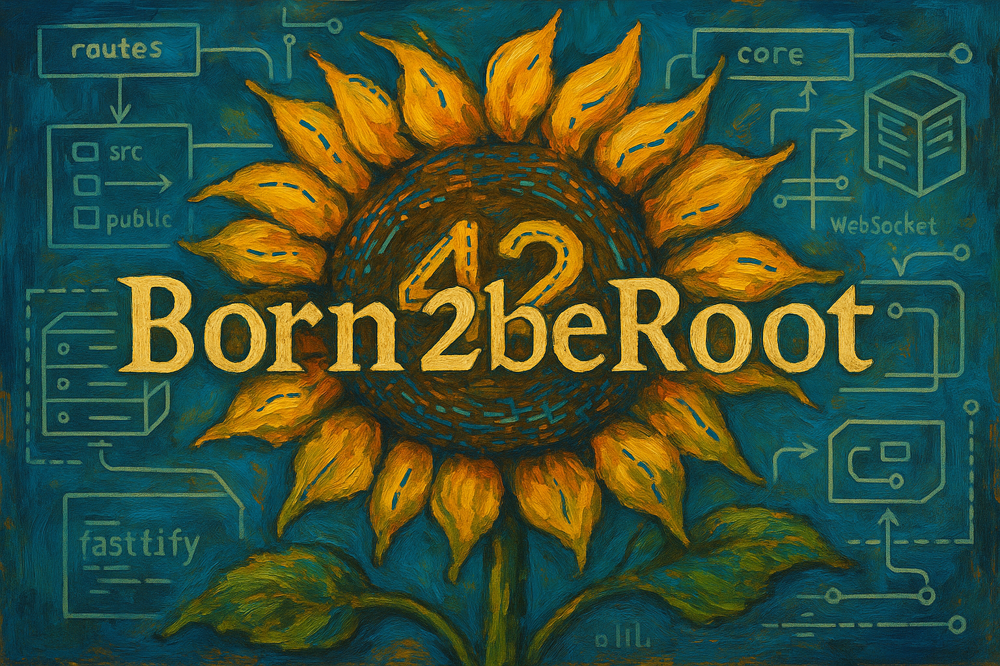
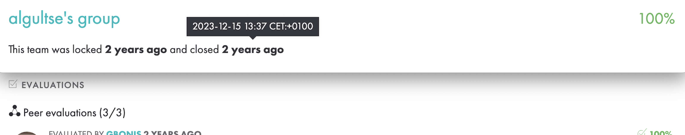

|           Grade          |                           |
|:------------------------:|:-------------------------:|
|  |  |

 

---

🇫🇷 FRENCH VERSION

	Il s'agit du quatrième <a href="./subject/Born2beRoot.fr.subject.pdf">projet</a> de l'école 42 (réalisé en décembre 2023).

## Préambule
Le but est de mettre en place une **machine virtuelle** Linux, sans interface graphique, en appliquant les bonnes pratiques d’administration système.

## Objectifs :
- Configuration d’un serveur sécurisé (`Debian` ou Rocky Linux).
- Politique de sécurité stricte (mot de passe, sudo, firewall).
- Partitionnement `LVM` chiffré, SELinux ou AppArmor actif.
- Script Bash `monitoring.sh` exécuté toutes les 10 minutes via cron.

## Fonctionnalités :
- Connexion `SSH` uniquement sur le port `4242`, sans accès root.
- Utilisateur non-root avec `sudo`, `user42`.
- Pare-feu actif, avec uniquement le `port` 4242 ouvert.
- Signature SHA1 du disque exigée (`signature.txt`).

---

🇬🇧 ENGLISH VERSION

 
    This is the fourth <a href="./subject/Born2beRoot.en.subject.pdf">project</a> at 42 School (completed in December 2023).

## Preamble
The goal is to set up a Linux **virtual machine** without a graphical interface, following best practices of system administration.

## Objectives:
- Configure a secure server (`Debian` or Rocky Linux).
- Enforce strict security policy (passwords, sudo, firewall).
- Encrypted `LVM` partitioning with SELinux or AppArmor enabled.
- A Bash script `monitoring.sh` runs every 10 minutes via cron.

## Features:
- `SSH` access only on port `4242`, with root access disabled.
- Non-root user with `sudo` and `user42` group.
- Active firewall with only `port` 4242 open.
- SHA1 signature of virtual disk required (`signature.txt`).

---

🇷🇺 RUSSIAN VERSION

    Это четвёртый <a href="./subject/Born2beRoot.en.subject.pdf">проект</a> в школе 42 (выполненный в декабре 2023 года).

## Преамбула
Цель — настроить **виртуальную машину** Linux без графического интерфейса, соблюдая лучшие практики системного администрирования.

## Задачи:
- Настроить безопасный сервер (`Debian` или Rocky Linux).
- Строгая политика безопасности (пароли, sudo, firewall).
- Зашифрованное `LVM`-разбиение, активный SELinux или AppArmor.
- Bash-скрипт `monitoring.sh`, выполняющийся каждые 10 минут через cron.

## Возможности:
- `SSH`-доступ только по порту `4242`, без доступа для root.
- Пользователь без root-прав, но с доступом через `sudo`, в группе `user42`.
- Активный файрволл, открыт только `порт` 4242.
- Требуется SHA1-подпись виртуального диска (`signature.txt`).

---

 